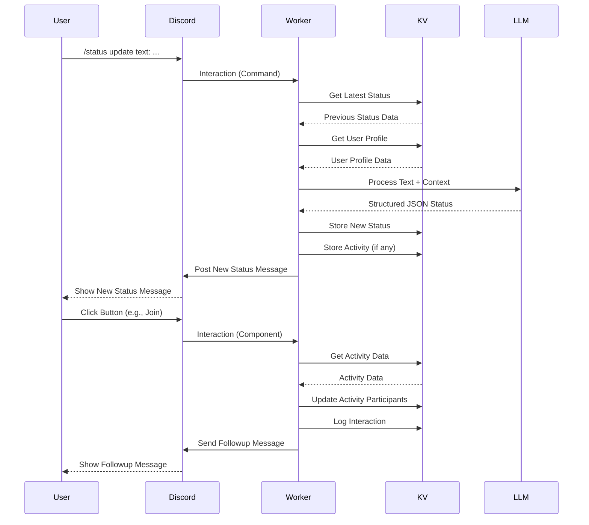

# Discord Bot Status Flow

## System Flow

```
User → Discord Interaction (Slash Command / Component) → Cloudflare Worker → KV (Context/Profile) → LLM Processing → KV (Store Result) → Discord API (Post New Message / Respond)
```

## Detailed Process Flow

1.  **User Input via Discord:**
    *   User invokes a slash command (e.g., `/status update`, `/template use`, `/profile view`).
    *   User clicks a component (button/select menu) on an existing status message.

2.  **Discord Interaction Trigger:**
    *   Discord sends an interaction payload to the Worker's `/interactions` endpoint.
    *   Payload includes user info, command/component data, interaction token, etc.

3.  **Cloudflare Worker Processing (`src/index.js` -> `src/discord/interactions.js`):**
    *   Worker verifies the request signature (`src/discord/verify.js`).
    *   Initializes configuration (`src/config.js`), including KV binding.
    *   Routes the interaction based on type (command or component) to the appropriate handler.
    *   For potentially long operations (`/status update`, `/template use`, `join_activity`, `react`), sends a deferred response to Discord.

4.  **Command/Component Handling (`src/discord/*.js`):**
    *   Specific handler (e.g., `processStatusUpdate`, `handleTemplateCommand`, `handleComponentInteraction`) executes.
    *   Retrieves necessary data from KV (previous status, user profile, templates, activities) via `src/storage/*.js`.
    *   **(If status update):** Prepares context-aware prompt, calls LLM (`src/llm/processor.js`).
    *   **(If status update):** Processes LLM response, applies custom emojis, creates activity record if needed (`src/api/status.js`, `src/storage/activity.js`).
    *   **(If status update):** Stores new status entry and updates history (`src/storage/kv.js`).
    *   **(If component):** Performs action (e.g., logs interaction, sends DM, joins activity, formats details).

5.  **Response Generation (`src/discord/embeds.js`):**
    *   **(If status update):** Formats the final status data into a themed embed with interactive components.
    *   **(If other command/component):** Formats appropriate response (ephemeral message, embed, etc.).

6.  **Discord API Interaction (`src/discord/api.js`):**
    *   **(If status update):** Posts a *new* status message to the configured channel (`createStatusMessage`).
    *   **(If deferred command):** Edits the original interaction response (`editInteractionResponse`).
    *   **(If component action):** Sends a followup message (`sendInteractionFollowup`), edits the original response (`editInteractionResponse`), or sends a DM (`sendDirectMessage`).
    *   **(If direct command response):** Returns the formatted response payload to the interaction handler.

## Data Flow Diagram (Simplified)


